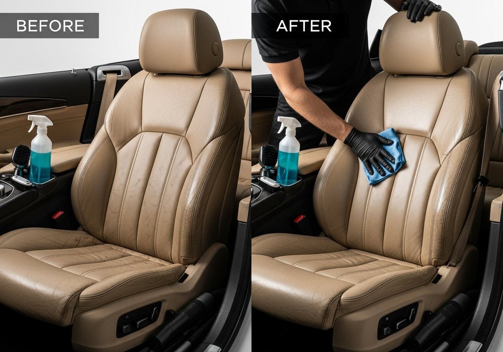

# 📋 INSTRUÇÕES DE INSTALAÇÃO NO CPANEL

## Como Instalar o Site da AutoLimpeza Pro no cPanel

### 🔧 Pré-requisitos
- Acesso ao cPanel do seu provedor de hospedagem
- Conta de hospedagem ativa com suporte a HTML/CSS/JavaScript

### 📂 Passo 1: Preparar os Arquivos
1. Faça o download do arquivo `index.html` do projeto
2. Crie uma pasta chamada `assets` no seu computador
3. Faça o download das seguintes imagens e coloque na pasta `assets`:
   - `Car_interior_cleaning_demonstration_edf68863.png`
   - `Residential_sofa_cleaning_service_947e9cc3.png`
   - `Professional_curtain_cleaning_service_b02dc7bd.png`
   - `Professional_carpet_cleaning_demonstration_77462bde.png`
   - `Automotive_aesthetic_detailing_service_d1cdb713.png`
   - `Automotive_glass_treatment_service_82519496.png`

### 🌐 Passo 2: Acessar o cPanel
1. Faça login no seu cPanel
2. Procure pela seção **"Arquivos"** ou **"Files"**
3. Clique em **"Gerenciador de Arquivos"** ou **"File Manager"**

### 📁 Passo 3: Navegar até a Pasta do Site
1. No Gerenciador de Arquivos, navegue até a pasta `public_html`
2. Esta é a pasta raiz do seu site
3. Se você tem um subdomínio, navegue até a pasta correspondente

### ⬆️ Passo 4: Upload dos Arquivos
1. Clique no botão **"Upload"** no topo da página
2. Selecione o arquivo `index.html` e faça o upload
3. Crie uma pasta chamada `assets` dentro de `public_html`
4. Entre na pasta `assets` e faça upload de todas as imagens

### ✏️ Passo 5: Editar as Referências das Imagens
1. Volte para `public_html` e clique com o botão direito no arquivo `index.html`
2. Selecione **"Code Editor"** ou **"HTML Editor"**
3. Encontre todas as linhas que contêm `attached_assets/generated_images/`
4. Substitua por `assets/`

**Exemplo de substituição:**
```html
<!-- DE: -->


<!-- PARA: -->

```

### 📞 Passo 6: Configurar o WhatsApp
1. No mesmo editor, encontre a linha com `5511999999999`
2. Substitua pelo seu número do WhatsApp no formato internacional
3. **Exemplo:** Para o número (11) 99999-9999, use: `5511999999999`

### 📧 Passo 7: Atualizar Informações de Contato
Edite as seguintes informações no arquivo:
- **Telefone:** Substitua `(11) 99999-9999` pelo seu número
- **WhatsApp:** Substitua `(11) 99999-9999` pelo seu WhatsApp
- **Email:** Substitua `contato@autolimpezapro.com.br` pelo seu email
- **Endereço:** Substitua por seu endereço completo
- **Horários:** Atualize os horários de funcionamento

### 🎨 Passo 8: Personalizar (Opcional)
Você pode personalizar:
- **Nome da empresa:** Substitua "AutoLimpeza Pro" pelo nome da sua empresa
- **Cores:** Modifique as variáveis CSS no início do arquivo
- **Preços:** Atualize os preços dos serviços
- **Textos:** Adapte os textos conforme sua realidade

### ✅ Passo 9: Testar o Site
1. Salve todas as alterações
2. Acesse seu domínio no navegador
3. Teste o formulário de orçamento
4. Verifique se o WhatsApp abre corretamente
5. Teste em dispositivos móveis

### 🔍 Solução de Problemas Comuns

#### ❌ Imagens não aparecem
- Verifique se as imagens estão na pasta `assets`
- Confirme se os nomes dos arquivos estão corretos
- Verifique as permissões das pastas (644 para arquivos, 755 para pastas)

#### ❌ WhatsApp não funciona
- Confirme se o número está no formato internacional
- Remova espaços, parênteses e hífens do número
- Teste com um número diferente

#### ❌ Site não carrega
- Verifique se o arquivo se chama exatamente `index.html`
- Confirme se está na pasta `public_html`
- Limpe o cache do navegador

### 🎯 Dicas Importantes
- ✅ Sempre faça backup antes de editar
- ✅ Teste em navegadores diferentes
- ✅ Mantenha os arquivos organizados
- ✅ Use nomes de arquivos sem espaços ou acentos
- ✅ Atualize regularmente as informações de contato

### 📞 Suporte
Se precisar de ajuda adicional:
1. Consulte a documentação do seu provedor de hospedagem
2. Entre em contato com o suporte técnico da hospedagem
3. Verifique se JavaScript está habilitado no seu provedor

---

**✨ Seu site estará pronto para receber clientes!**

O site é totalmente responsivo e funcionará perfeitamente em computadores, tablets e celulares.